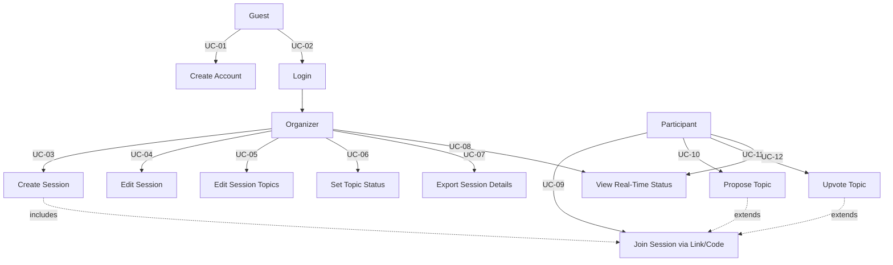

# Lean Convo – Use Case Document

## Overview

Lean Convo is a web application that facilitates **Lean Coffee** sessions — structured, agenda-less meetings where participants collaboratively propose and vote on discussion topics.

---

## Actors

| Actor | Description |
|---|---|
| **Guest** | An unauthenticated user visiting the application |
| **Registered User** | A user with a verified account who can act as an Organizer |
| **Organizer** | A Registered User who creates and manages a session |
| **Participant** | A person who joins a session (may or may not be logged in) |

---

## Use Case Diagram (Textual)

```
+------------------------------------------------------------+
|                     Lean Convo System                      |
|                                                            |
|  [Guest]                                                   |
|    |-- UC-01: Create Account                               |
|    |-- UC-02: Login                                        |
|                                                            |
|  [Organizer]                                               |
|    |-- UC-03: Create Session                               |
|    |-- UC-04: Edit Session                                 |
|    |-- UC-05: Edit Session Topics                          |
|    |-- UC-06: Set Topic Status (Todo / Active / Done)      |
|    |-- UC-07: Export Session and Topic Details             |
|    |-- UC-08: View Session and Topic Status (Real-Time)    |
|                                                            |
|  [Participant]                                             |
|    |-- UC-09: Join Session via Link or Code                |
|    |-- UC-10: Propose Topic                                |
|    |-- UC-11: Upvote Topic                                 |
|    |-- UC-12: View Session and Topic Status (Real-Time)    |
+------------------------------------------------------------+
```

---

## Use Cases

---

### UC-01: Create Account

| Field | Detail |
|---|---|
| **ID** | UC-01 |
| **Name** | Create Account |
| **Actor(s)** | Guest |
| **Description** | A new user registers for an account to gain Organizer capabilities |
| **Preconditions** | User does not have an existing account |
| **Main Flow** | 1. User navigates to the registration page. 2. User provides required registration details. 3. System creates and stores the account. 4. User is logged in and redirected to the dashboard. |
| **Postconditions** | User has a registered account and is authenticated |

---

### UC-02: Login

| Field | Detail |
|---|---|
| **ID** | UC-02 |
| **Name** | Login Using Existing Account |
| **Actor(s)** | Registered User |
| **Description** | An existing user authenticates to access Organizer features |
| **Preconditions** | User has a registered account |
| **Main Flow** | 1. User navigates to the login page. 2. User enters credentials. 3. System validates credentials. 4. User is redirected to the dashboard. |
| **Alternate Flow** | 3a. Credentials are invalid — system displays an error message. |
| **Postconditions** | User is authenticated and can create/manage sessions |

---

### UC-03: Create Session

| Field | Detail |
|---|---|
| **ID** | UC-03 |
| **Name** | Create Session |
| **Actor(s)** | Organizer |
| **Description** | The organizer creates a new Lean Coffee session with configurable settings |
| **Preconditions** | Organizer is authenticated |
| **Main Flow** | 1. Organizer selects "Create Session". 2. Organizer provides a session **title** and **description**. 3. System generates a shareable **link/code** for participants. 4. Organizer optionally provides a **video platform link** (e.g., Zoom, Teams). 5. Organizer sets the maximum number of **up-votes per participant** (`n`). 6. System saves the session and displays the shareable link/code. |
| **Postconditions** | A new session exists and is ready for participants to join |

---

### UC-04: Edit Session

| Field | Detail |
|---|---|
| **ID** | UC-04 |
| **Name** | Edit Session |
| **Actor(s)** | Organizer |
| **Description** | The organizer updates session-level details after creation |
| **Preconditions** | Session exists and the Organizer owns it |
| **Main Flow** | 1. Organizer opens the session management view. 2. Organizer updates title, description, video platform link, or vote limit. 3. System saves the changes. |
| **Postconditions** | Session record is updated; participants see the latest details |

---

### UC-05: Edit Session Topics

| Field | Detail |
|---|---|
| **ID** | UC-05 |
| **Name** | Edit Session Topics |
| **Actor(s)** | Organizer |
| **Description** | The organizer modifies topic details (title, description, or order) within a session |
| **Preconditions** | Session exists with at least one topic |
| **Main Flow** | 1. Organizer opens the topics list for the session. 2. Organizer selects a topic and edits its title or description. 3. System saves the updated topic. |
| **Postconditions** | Topic record is updated; all participants see the updated topic |

---

### UC-06: Set Topic Status

| Field | Detail |
|---|---|
| **ID** | UC-06 |
| **Name** | Set Topic Status (Todo / Active / Done) |
| **Actor(s)** | Organizer |
| **Description** | The organizer controls the lifecycle of each topic during the session |
| **Preconditions** | Session is in progress; topics exist |
| **Main Flow** | 1. Organizer views the ranked topic list. 2. Organizer sets a topic status to **Todo**, **Active**, or **Done**. 3. System updates the status and broadcasts the change in real time. |
| **Postconditions** | All participants see the updated topic status immediately |

---

### UC-07: Export Session and Topic Details

| Field | Detail |
|---|---|
| **ID** | UC-07 |
| **Name** | Export Session and Topic Details |
| **Actor(s)** | Organizer |
| **Description** | The organizer exports a summary of the session and its topics for record-keeping or sharing |
| **Preconditions** | Session exists |
| **Main Flow** | 1. Organizer selects the export option on the session view. 2. System compiles session metadata and all topic details (title, description, votes, status). 3. System produces a downloadable file (e.g., CSV or PDF). 4. Organizer downloads the export. |
| **Postconditions** | Organizer has a portable record of the session |

---

### UC-08 / UC-12: View Session and Topic Status in Real Time

| Field | Detail |
|---|---|
| **ID** | UC-08 / UC-12 |
| **Name** | View Session and Topic Status (Real-Time) |
| **Actor(s)** | Organizer, Participant |
| **Description** | All active users in a session can see live updates to session and topic status without refreshing |
| **Preconditions** | User is in an active session (organizer or participant) |
| **Main Flow** | 1. User opens the session view. 2. System establishes a real-time connection. 3. Any change to topic status or vote count is pushed to all connected users instantly. |
| **Postconditions** | User always sees the current state of the session |

---

### UC-09: Join Session via Link or Code

| Field | Detail |
|---|---|
| **ID** | UC-09 |
| **Name** | Join Session via Link or Code |
| **Actor(s)** | Participant |
| **Description** | A participant joins an existing session using the shareable link or code provided by the Organizer |
| **Preconditions** | Session exists and is active |
| **Main Flow** | 1. Participant receives a session link or code from the Organizer. 2. Participant navigates to the link or enters the code. 3. Participant provides their **name** and optionally a **LinkedIn profile link**. 4. System adds the participant to the session. 5. Participant is taken to the live session view. |
| **Alternate Flow** | 3a. Participant proceeds without logging in (anonymous join is allowed). |
| **Postconditions** | Participant is in the session and can propose topics and vote |

---

### UC-10: Propose Topic

| Field | Detail |
|---|---|
| **ID** | UC-10 |
| **Name** | Propose Topic |
| **Actor(s)** | Participant |
| **Description** | A participant submits a new topic for consideration during the session |
| **Preconditions** | Participant has joined an active session |
| **Main Flow** | 1. Participant selects "Propose Topic". 2. Participant enters a **topic title** and **description**. 3. System adds the topic to the session's topic list. 4. All participants and the Organizer see the new topic in real time. |
| **Postconditions** | A new topic is visible to all session members |

---

### UC-11: Upvote Topic

| Field | Detail |
|---|---|
| **ID** | UC-11 |
| **Name** | Upvote Topic |
| **Actor(s)** | Participant |
| **Description** | A participant votes for topics they want to discuss, subject to a session-defined vote limit |
| **Preconditions** | Participant has joined an active session; topics exist; participant has remaining votes |
| **Main Flow** | 1. Participant views the topic list. 2. Participant clicks the upvote button on a topic. 3. System increments the vote count for that topic. 4. System decrements the participant's remaining vote balance. 5. Updated vote counts are broadcast in real time. |
| **Business Rule** | Each participant is limited to `n` total votes, where `n` is configured by the Organizer at session creation (UC-03). |
| **Alternate Flow** | 2a. Participant has used all `n` votes — system prevents additional votes and shows a notification. |
| **Postconditions** | Topic vote count is updated; ranked list may re-order accordingly |

---

## Use Case Relationships Summary



---

## Constraints and Business Rules

| Rule | Description |
|---|---|
| **Vote Limit** | Each participant may cast at most `n` upvotes total per session, where `n` is set by the Organizer during session creation |
| **Anonymous Join** | Participants are NOT required to have an account to join a session; only a name is required |
| **LinkedIn Link** | Providing a LinkedIn profile link is optional for participants at join time |
| **Video Link** | Setting a video platform link on a session is optional for the Organizer |
| **Real-Time Updates** | All session status and topic vote changes must be visible to all connected users without manual page refresh |
| **Topic Lifecycle** | Topics progress through three states: **Todo → Active → Done**, controlled exclusively by the Organizer |
